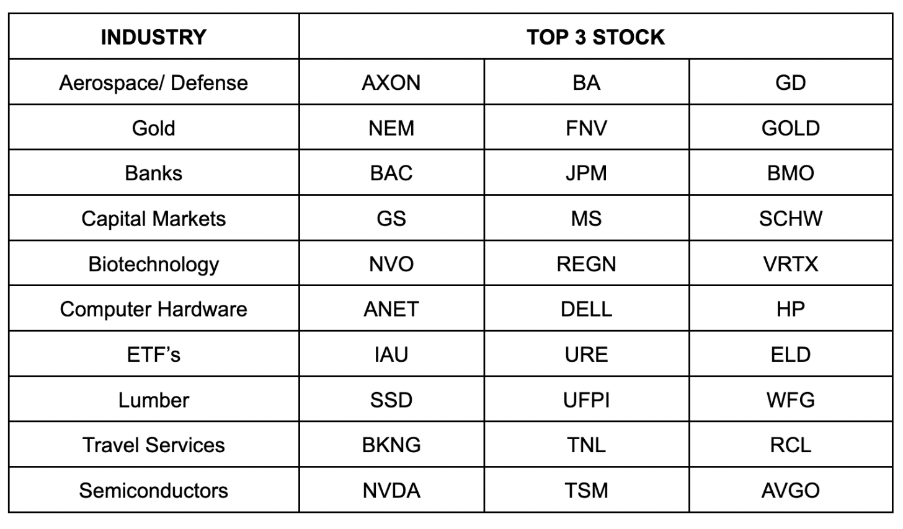
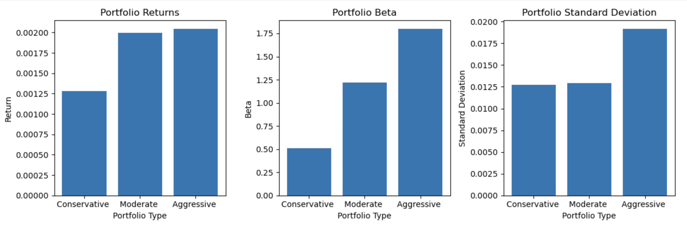
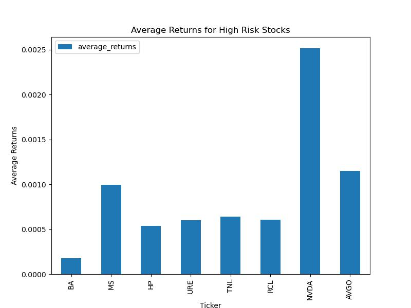
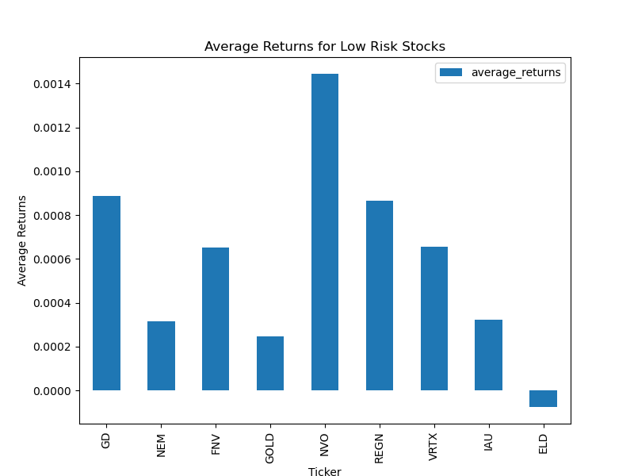
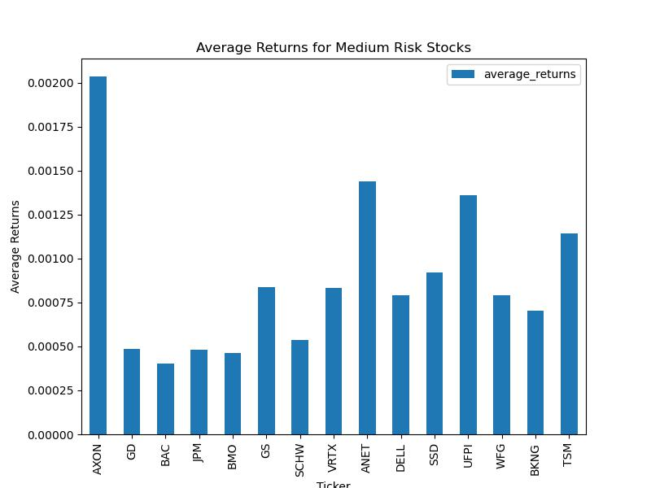
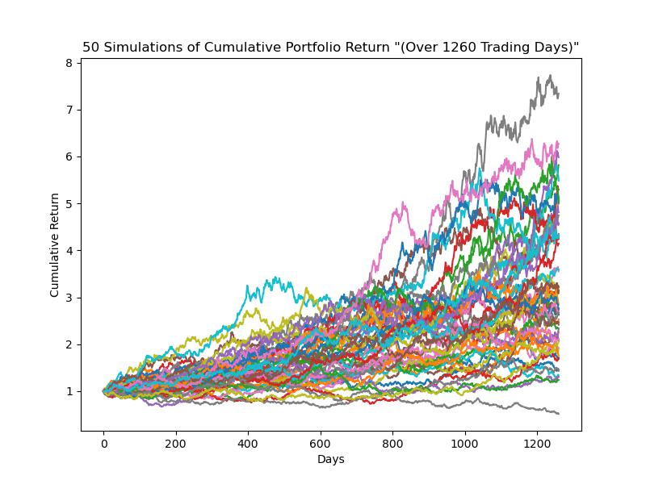
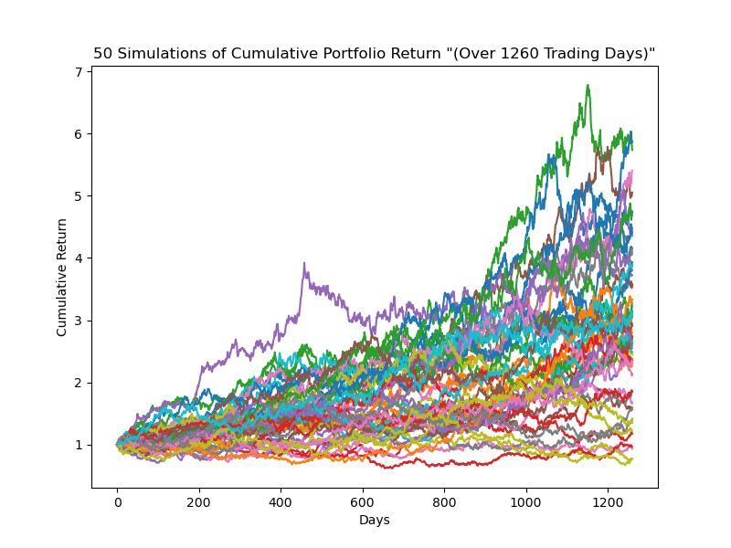
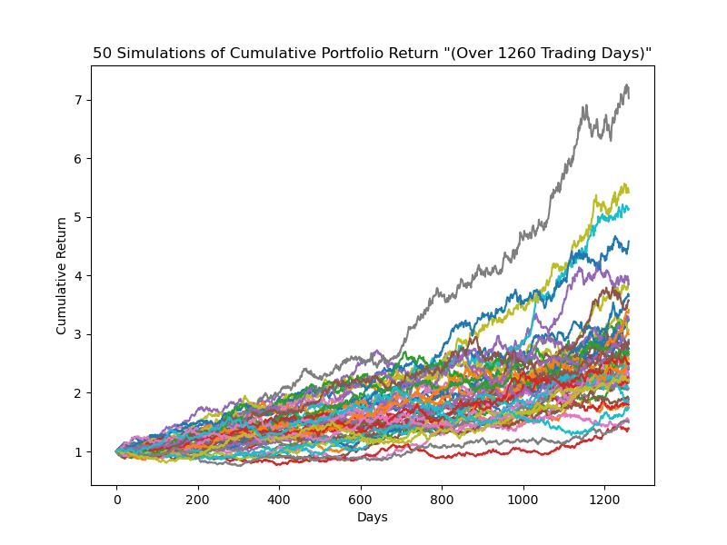

# Group_5_Project_1
## Portfolio Powerhouse
### **Team Members: Athura Thavathasan, Nicholas Gracan, Brandon Petrie, Pablo Aray Acevedo**
*Presentation April 19, 2023*

### To access the Prezi presentation use the following link: 
https://prezi.com/view/6ZizWSKOXKrNWj8V2KCn/

## Motivation
### Define the core message or hypothesis of the project:

We believe that investment choices can be better optimized with the use of various, rigorous data analysis techniques that utilize quantitative statistics to produce portfolio options for all types of investors. Exploring the risk and returns of various assets across different investments will allow us to better and more accurately position those stocks within the correct portfolio. 

### Describe the questions that were asked, and why they were asked:

The question that led us to the idea for this project was that we wanted to know if random stocks from various financial industries could be analyzed based on various risk and return metrics that would allow us to optimize portfolio creation to better suit different investors risk and return profiles. If investors were able to collect a group of stocks they might be interested in and run them through our code, it would produce an analysis notebook that would quickly provide quantitative information and insight into the different characteristics of each portfolio option and the characteristics of the assets they are made up of. This code would also provide investors with an outlook at potential returns of each portfolio over a 5 year period with whatever variable amount of investment in each portfolio they would choose. 

### Describe whether the questions were answered to your satisfaction, and briefly summarize the findings:

The two main questions we proposed at the beginning of our project were ultimately answered in the example code analysis we provide in our project. Our code efficiently retrieves and outputs a dataframe, with the use of our stock ticker function, the desired metrics to analyze the differences between standard deviations, betas, sharpe ratios, and average returns for each stock chosen to be part of the analysis. This gives an investor an accurate picture of the risk and returns associated with each asset that's been included for use. Next the application will produce those same metrics for each of the three portfolios which visually provides investors an accurate representation of the risk and returns associated with each of the different portfolios our code will create. The last portion of the Portfolio Powerhouse’s analysis produces a numeric and visual representation of the future potential returns of a 5 year variable investment in each one of our conservative, moderate, and aggressive portfolios. The overall analysis conducted in the Portfolio Powerhouses code will satisfy an investor's needs to see how potentially appealing assets can be grouped together into different portfolios for investment and then to see which one best suits their own specific risk and return profiles. 

## Questions & Data

### Provide more detail on the questions posed, including what kind of data was needed to answer them, and where it was found:

To create our different portfolios we needed historical time-series closing price data on all the different stocks and the benchmark we were using for the analysis. To retrieve this data, we set a 5-year time period for our query and utilized the yahoo finance library provider in our jupyter notebook to pull the data from yahoo finance and convert it into pandas dataframes from there. To perform the calculations for the average returns, cumulative returns, rolling standard deviation and beta we needed to convert the closing prices from the yahoo data on the stocks and benchmark, to daily returns for each asset. 

## Data Cleanup & Exploration

### Describe the exploration and cleanup process:

During the data exploration and cleanup process we needed to retrieve data on all the stocks and produce a single dataframe that contained all the information we needed for analysis. We then used pandas to calculate the daily returns of all stocks and drop any null values in the data frame. The data frame was checked for any missing or duplicated data points before moving forward with the analysis. Once the analysis was completed on all stocks, the data from the analysis was then manipulated through four metrics and returned 3 separate dataframes which would then be our three portfolios.

### Importing Libraries
For this code to run, pleae download the corresponding libraries:

* We imported `yfinance` to pull data from yahoo finances website.
* We used `pandas` to create dataframes with that data.
* We used `matplotlib` to create graphs. 
* `numpy` was used in calculating the metrics in our function. 
* We contemplated using `seaborn` to spruce up the graphs 
* `sqlalchemy` was used to query data from sql and create the list of tickers
* `os` was used  

### SQL Data
* Created a database using `postgresSQL`
* Import data using cvs files or `insert_info.sql`
* Create an `engine` to connect the database to the notebook
* Create a query the joins the industry and `industry_type` into one dataframe
* Used `del` to remove duplicating information
* From that data we created a pandas dataframe.

### Variable Declaration
* Convert ticker dataframe using `values.tolist`
* Start and end dates were defined along with the benchmark ticker

### Function
A function was created, to create a dataframe that included all the tickers from the ticker list and found four metrics: beta, standard deviation, sharpe_ratio and average returns 
* The function starts by defining its parameters ( the ticker list, benchmark data, start date and end date) 
* The function begins by pulling the close prices for all of the tickers
* It then computes them into daily percentage
* Outside of the function the benchmark data close is downloaded in. This was done outside so the same data wouldn't be downloaded 27 times.
* The ticker and benchmark data is then cleaned removing nulls. The next step was to define the metrics, `numpy` was used here.
* The function computes the metrics and stores the information into a dictionary
* A for loop was then used to call this function, run through all the metrics for each ticker and compute a dictionary, the next line converts the dictionary into a data frame called `data_df`.

### Filtering Stocks 
Now that we had a data frame of all the tickers and their metrics we could start filtering the tickers into individualized portfolios based on risk. In this section we defined the filtering parameters for standard deviation, beta and sharpe_ratio. 
The parameters we decided to use was by taking the lowest and highest value for each metric dividing them into thirds. From the dataframe, the tickers ran through each of the different parameters and were filtered into three portfolios: low, medium level and high level risk.
For Each Risk Level:
* Filtered the `data_df` outputed from the function through the beta parameters and stored into a dataframe
* The beta dataframe was filtering further into the standard deviation parameters and stored into a dataframe
* The standard deviation dataframe was filtering further into the sharpe ratio parameters and stored into a dataframe
* Using `concat` to combine all three data frames into one 

### Portfolio Creation
* The three different portfolios had varying amounts of stocks in them. 
* We then plotted the average returns for each of the tickers. 
* We decided 5 different shares was the max we would want in a portfolio, so we used the `nlargest`t function and set n to 5. 
* This helped create the stocks with the highest performance per portfolio
* We assigned weights to each portfolio:
* For any negative sharpe ratio, we assigned the value to 0.01 or 1% of the portfolio
* Calculate the sum of negative weight as well as the total postive weight
* Distribute the remaining portfolio to using the sharpe ratio value
* Calculated each portfolio’s beta, average return, standard deviation
* Create and store calculation into a dataframe

Discuss any insights you had while exploring the data that you didn't anticipate.

One insight we found analyzing the monte carlo simulations is that over the 5 years the aggressive portfolio has the greatest chance of success, but it is the only graph that has potential to have a negative outcome.

Discuss any problems that arose after exploring the data, and how they were resolved.

The range calculations for the filtering stocks section was where we ran into a problem as the metrics we were trying to filter out into different portfolios was creating a issue and making the analysis messier as there were values with multiple decimal places for each individual stock that we would have to refer to exactly to filter. 

### Present and discuss interesting figures developed during exploration, ideally with the help of Jupyter Notebook:

The ability to make results interactive and clear for investors to compare different variables is crucial. Monte Carlo simulation is a useful tool for forecasting future prices based on past performance, though it doesn't guarantee that the forecast will occur. Yahoo Finance is a valuable resource for obtaining necessary information and filtering it to suit your needs, without the need to use a CSV file.

The capacity to filter and clean information to fit the needs of the application, as well as the investor's preferences, is essential. When you have access to a reliable library or open API, the information it provides is key to identifying and analyzing the variables that each individual considers when assessing investments based on risk.

In conclusion, Jupyter Notebook allows us to deconstruct a project and revisit specific parts, making necessary adjustments as needed. It provides the ability to preview the code written for each particular section, making it an ideal tool for breaking a project down into its key components. Ultimately, Jupyter Notebook enables us to generate the final result and offer financial support to investors using the app.

## Data Analysis

### Discuss the steps taken to analyze the data, and answer each question that was asked in your proposal:

Our main goal since the beginning was to help people make better decisions to invest based on their own risk tolerance. With our application and approach we missed some key features such as KYC, access to a larger database of stocks and user input to create and compare its own portfolio vs the benchmarks. 

Nonetheless, we were able to provide investors assessing the beta of each investment to determine its volatility compared to the benchmark (SPY and other portfolios). Help them assess historical data using each individual stock and portfolio return as well as SPY over a period over 5 years. This is useful to identify trends and assess past performance. 

In addition to that, providing the Standard Deviation they are able to measure the risk of each asset. With the Shrape ratio investors will have a great way to compare the investment they are looking vs the risk free rate asset (In most cases US will be T-bills) providing a realistic view of risk- adjusted returns of each investment.

To conclude, the most important part was to provide investors with the tool to choose the most desirable investment based on their risk tolerance. This application will help customers struggling to diversify their current portfolios. 

### Could we create an analysis notebook that will analyze random stocks based on their historical data to help us create a personalized portfolio?

Yes, an analysis notebook that analyzes random stocks based on historical data to help build personalized portfolios is feasible. Yahoo Finance data sources can be leveraged as sources for historical stock information while machine learning techniques like regression models, sentiment analysis and time series forecasting can provide insightful analysis results from stock data analyzed within.

An analysis notebook can be configured to assess stocks based on various financial metrics, including Sharpe Ratio, standard deviation, beta, portfolio returns and Bollinger Bands technical indicator - with clustering functions that identify similarities among stocks to create personalized portfolios that suit an investor's risk tolerance, investment horizon and financial goals - the notebook will generate diverse, well-balanced portfolios designed to minimize risks while optimizing returns.

## Discussion

### Discuss your findings. Did they meet your expectations, and if not, why? What inferences or general conclusions can be drawn from your analysis?
-From the initial table we created with the 30 tickers and their beta, standard deviation, sharpe_ratio and average returns.  Only 1 of the 30 companies had a negative average return.

-Based on the average returns, the conservative portfolio had an average return of roughly .009%.  The moderate portfolio had roughly the same overall average returns with a couple stocks having higher ones.  The aggressive portfolio had stocks with similar  returns to the other portfolios, but with a couple stocks having even higher yields.

The conservative portfolio had a beta of .5, whereas the moderate portfolio had a beta of 1.25 and the aggressive portfolio had a beta of 1.75.  These results were to be expected.  However because we took the 3 largest companies per sector, I am surprised to see the moderate and aggressive portfolios have betas significantly higher than 1.

-The conservative and moderate portfolios had similar standard deviations with the aggressive portfolio having  the largest.

-For the Monte Carlo simulations, the aggressive portfolio most likely would have returned the highest yields and had potential to return the highest yield.  But it was the only portfolio that had a chance of yielding a negative return.  

-The moderate portfolio seemed very likely to yield a solid positive return.  It also had potential to yield a very high return.

-The conservative portfolio seemed to have the same likelihood as yielding the same as the moderate portfolio, without the chance of yielding a higher return.

-This could have been due to the more conservative stocks paying out dividends.  From the simulations it would be advised to invest in the aggressive portfolio if your time horizon is 3 years or greater.  Overall the findings did meet our expectations.

## PostMortem

### Discuss any difficulties that arose, and how they were handled:

Getting the data frame to have the same number of arrays of data, as one of the tickers IPO’d much more recently than the others.  This was handled with an if statement that adjusted the size of the data to the ticker with the shortest length of time.
git pushing/pulling with github and the branches.
Trying to filter the data into the three portfolios based on risk with a for statement.  This was overcome by creating a data frame by pulling information from a specific column and adding filters to the statement.

Discuss any additional questions that arose, which couldn't be answered due to time constraints.

One graph we would have liked to have ready for today was to have the cumulative daily returns for each of the portfolios with their weights included against the SPY and BRK-A.
Another element to this project we wanted to accomplish was to have a user interaction.  We wanted to have the user type in the tickers in their own portfolio and their weights and also have that plotted against the three made up portfolios and the benchmarks.  This is for the user to see how they would have performed and how their portfolio is forecasted to do against the others.  We tried to originally do this with “questionnaire”, but had little luck running it in a jupyter notebook.  We then started to try to do this with the input() function.

### What would you research next if you had two more weeks?:

-We would have liked to create a user interaction interface, so customers can create their own portfolio including the different stocks and weights and compare it to bench marks or the portflios we created.

-We could have also created a KYC as well as try to add more factors that will help make a better investments decision.

## Installation Instructions
To run this code please input this on your terminal so it downloads the corresponding libraries:

yfinance: Yahoo Finance
* yfinance is a library that allows users to access financial data from Yahoo Finance.

pandas: Python Data Analysis Library
* pandas is an open-source library providing data structures and data analysis tools for the Python programming language.

numpy: Numerical Python
* numpy is a library for the Python programming language, adding support for large, multi-dimensional arrays and matrices, along with a large collection of high-level mathematical functions to operate on these arrays.

sqlalchemy: SQL Alchemy
* sqlalchemy is a SQL toolkit and Object-Relational Mapping (ORM) library for the Python programming language, allowing users to work with relational databases.

matplotlib: Matplotlib
* matplotlib is a plotting library for the Python programming language and its numerical mathematics extension NumPy. It provides an object-oriented API for embedding plots into applications using general-purpose GUI toolkits like Tkinter, wxPython, Qt, or GTK.

seaborn: Seaborn
* seaborn is a Python data visualization library based on matplotlib. It provides a high-level interface for drawing attractive and informative statistical graphics.

* MCForecastTools: Monte Carlo Forecast Tools

	
Copy and paste the following command into your terminal to access the libraries 

`pip install yfinance pandas numpy sqlalchemy matplotlib seaborn`

